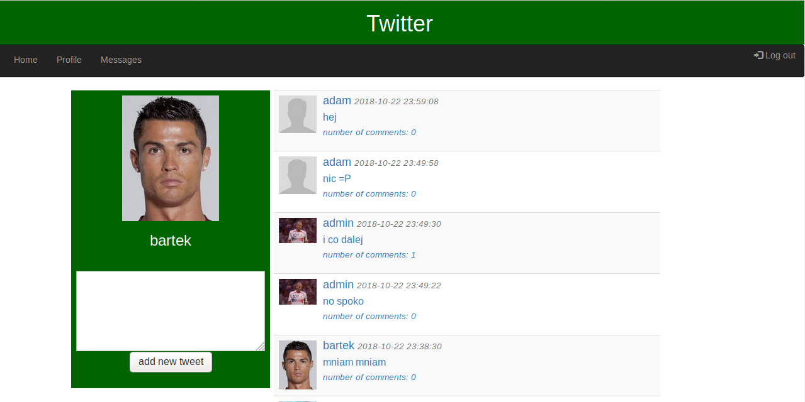
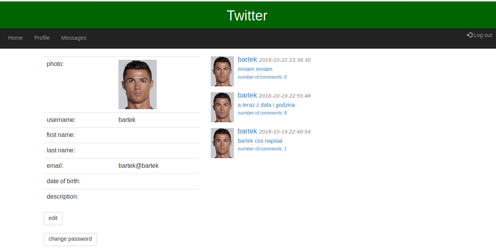
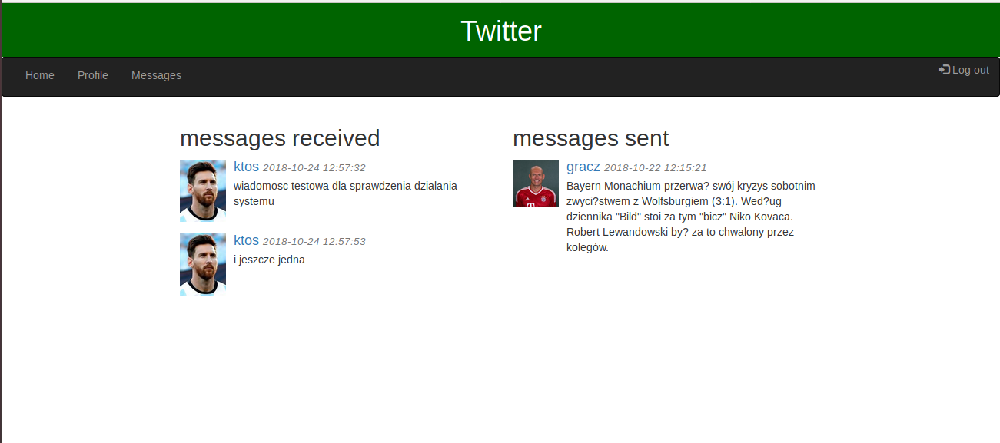

The user after registering and logging in can:
- publish tweets and comments
- read tweets and comments from other users
- edit your profile data
- send and receive messages from other users

The application uses:
- Java, Spring boot, Spring security, Spring data, Hibernate, Javax.mail, mySQL,Javax.servlet, Tomcat, JPA, JPQL
- HTML, CSS, JavaScript, JSTL, Bootstrap

  
  
  
